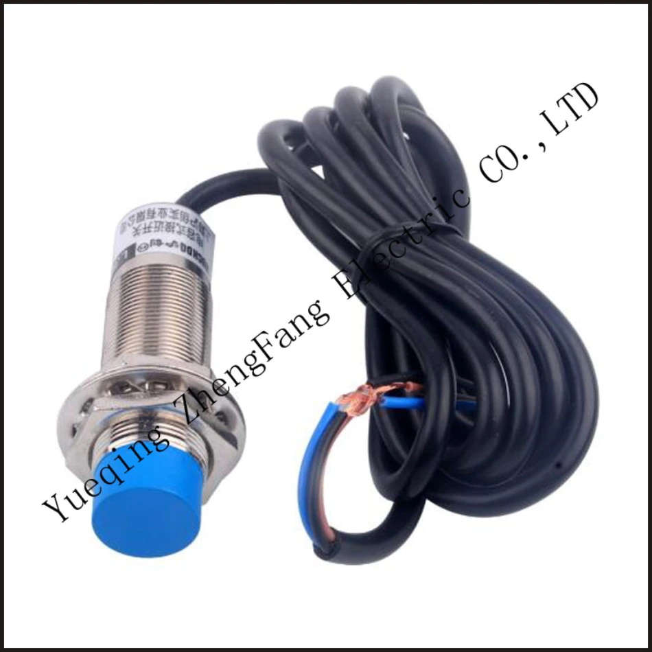
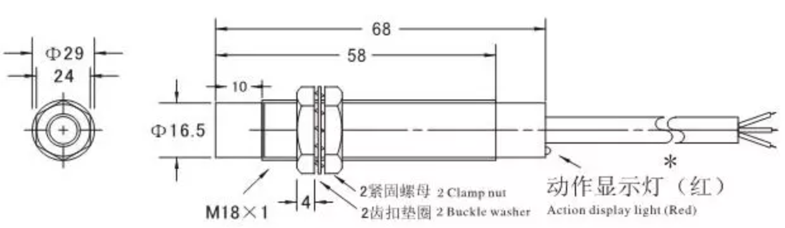
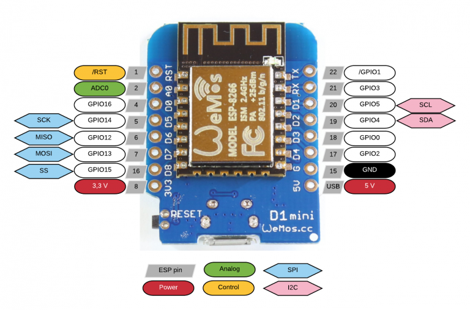

# Meet je waterverbruik in Home Assistant met behulp van esphome en gratis te printen houders voor je watermeter

Op deze pagina vind je alles wat je nodig hebt om een meter te maken waarmee je in Home Assistant je waterverbuik kunt monitoren.

## Nabijheidsensor LJ18A3-8Z/BX NPN NO
Ik heb in het verleden wel eens geprobeerd om een optische pulse counter te gebruiken voor mijn watermeter maar dat was niet echt een succes. Daarom adviseer ik om een nabijheidsensor te gebruiken.

Let op dat je de **5 volt** variant koopt en geen andere. Alleen de **5 volt** versie kan direct op je ESP aangesloten worden.

- Aliexpress: [LJ18A3-8Z/BX](https://www.aliexpress.com/item/32814668848.html) (Goedkoop maar langer wachten)
- Opencircuit: [LJ18A3-8-Z/BX](https://opencircuit.nl/product/lj18a3-8-z-bx-5v-nabijheids-sensor-n-o-npn-8mm) (Duurder maar sneller in huis)
- Amazon: [LJ18A3-8-Z/BX-5V](https://amzn.to/3xtTYy9) (Affiliate link van Bas)

**Let op** als je deze links gebruikt. Ik durf niet te garanderen dat er op een dag een ander type sensor achter de link komt die niet niet op **5 volt** werkt.

Neem de NPN versie. Het maakt niet uit of je een 'Normally Closed' (NC) of 'Normally Opened' (NO) versie koopt omdat we de overgangen tellen.

## ESP
Je kunt elke ESP gebruiken die ondersteund wordt door esphome maar de Wemos D1 mini is een goede optie. Hij is goedkoop en goed verkrijgbaar.

- Aliexpress: [Wemos D1 mini 3.0 (micro usb)](https://nl.aliexpress.com/item/32651747570.html) (Goedkoop maar langer wachten)
- Aliexpress: [Wemos D1 mini 4.0 (usb-c)](https://nl.aliexpress.com/item/1005004527213280.html) (Goedkoop maar langer wachten)
- Opencircuit: [Wemos D1 mini 4.0 (usb-c)](https://opencircuit.nl/product/wemos-d1-mini-v4.0-wifi-module) (Duurder maar sneller in huis)

## 3D geprinte houder voor op je watermeter

Kijk op de [Meters](meters) pagina of jouw meter er bij staat. Download de files voor je slicer en print je eigen houder.

Als je zelf geen 3D printer hebt, kun je een houder bestellen bij [Bast](https://www.bast-hout.nl/)

## Esphome configuratie

Je kunt [deze esphome configuratie](yaml/watermeter.yaml) gebruiken in esphome. 

## Meer informatie

- [Pieter Brinkmans blog](https://www.pieterbrinkman.com/2022/02/02/build-a-cheap-water-usage-sensor-using-esphome-home-assistant-and-a-proximity-sensor/)
- [Wouters blog](https://www.twoenter.nl/blog/domotica/watermeter-in-home-assistant-met-esphome/)
- [Installeer esphome in Home Assistant](https://esphome.io/guides/getting_started_hassio.html)
- [Esphome pulse counter](https://esphome.io/components/sensor/pulse_counter.html)
- [Huizebruin blog](https://www.huizebruin.nl/home-assistant/esphome/watermeter-uitlezen-in-home-assistant-met-esphome/_)