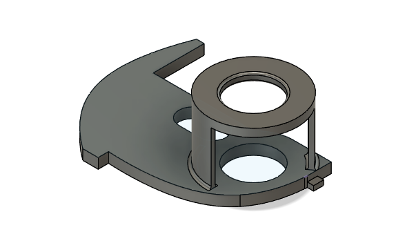

# Meet je waterverbruik in Home Assistant met behulp van esphome en gratis te printen houders voor je watermeter

Op deze pagina vind je alles wat je nodig hebt om een meter te maken waarmee je in Home Assistant je waterverbuik kunt monitoren.

## Nabijheidsensor LJ18A3-8Z/BX NPN NO

Let op dat je de **5 volt** variant koopt en geen andere. Alleen de **5 volt** versie kan direct op je ESP aangesloten worden.

- Aliexpress: [LJ18A3-8Z/BX](https://www.aliexpress.com/item/32814668848.html) (Goedkoop maar langer wachten)
- Opencircuit: [LJ18A3-8-Z/BX](https://opencircuit.nl/product/lj18a3-8-z-bx-5v-nabijheids-sensor-n-o-npn-8mm) (Iets duurder maar sneller in huis)
- Amazon: [LJ18A3-8-Z/BX-5V](https://amzn.to/3xtTYy9) (Affiliate link van Bas)

**Let op** als je deze links gebruikt. Ik durf niet te garanderen dat er op een dag een ander type sensor achter de link komt die niet niet op **5 volt** werkt.

Neem de NPN versie. Het maakt niet uit of je een 'Normally Closed' (NC) of 'Normally Opened' (NO) versie koopt omdat we de overgangen tellen.

## ESP

## Esphome configuratie
	
## 3D geprinte houder voor op je watermeter

Kijk op de [Meters](meters) pagina of jouw meter er bij staat. Download de files voor je slicer en print je eigen houder.

## Meer informatie

- [Pieter Brinkmans blog](https://www.pieterbrinkman.com/2022/02/02/build-a-cheap-water-usage-sensor-using-esphome-home-assistant-and-a-proximity-sensor/)
- [Wouters blog](https://www.twoenter.nl/blog/domotica/watermeter-in-home-assistant-met-esphome/)
- [Installeer esphome in Home Assistant](https://esphome.io/guides/getting_started_hassio.html)
- [Esphome pulse counter](https://esphome.io/components/sensor/pulse_counter.html)