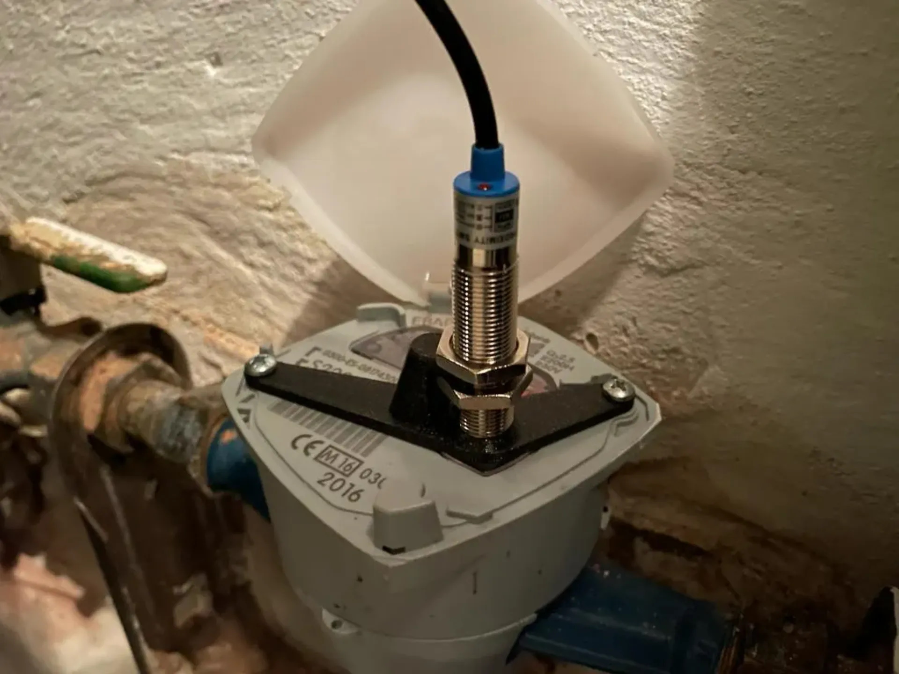

# S220 Elster
Houder voor met monteren van een nabijheidsensor op je S220 Elster water meter zodat je je waterverbruik kunt meten in Home Assistant.

## Afbeeldingen

## 3D print bestanden
- STL Format: [s220_elster.stl](s220_elster) (gebruik dit in je slicer programma) (Gekopieerd van [pru-135
](https://www.printables.com/en/model/250995-bracket-s220-elster-watermeter)

